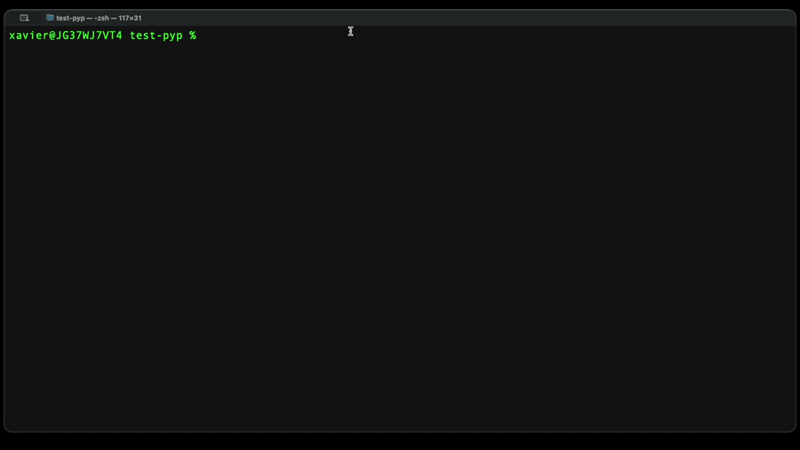
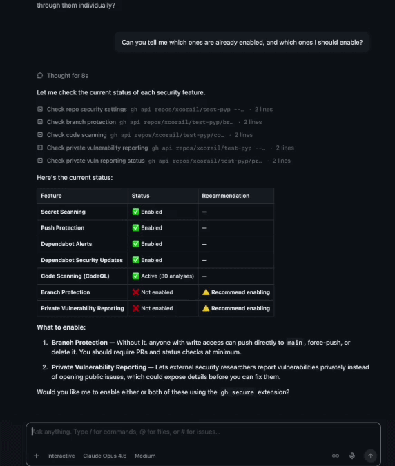

# gh-secure

## Protect your project in 2 minutes

A [GitHub CLI](https://cli.github.com) extension to enable security features on public repositories, following best practices from the [GitHub Security Lab](https://securitylab.github.com/).

### Everything we'll cover is free for open source

- Prevent malicious actors from exploiting vulnerabilities in your project
- Protect your private assets by preventing secrets from leaking to the internet
- Prevent malicious actors from exploiting publicly known vulnerabilities in your dependencies
- Prevent unwanted access and modifications to your project
- Prevent 0-days and exploits by keeping your security vulnerabilities private until they're fixed

### No security or coding skills needed

Only an open source project on GitHub where you have admin access.

## How do I use it? 

Running the tool will enable security features for your repository in 2 minutes or less.

You can use it from your terminal, with an interactive or a "just do it" mode. 



You can also use it from the GitHub Copilot CLI or the GitHub Copilot App, or any other AI assistant who has access to the tool. Ask for an overview of your repository's security, ask for details on specific features, and ask the tool to enable the missing features for you.



## Installation

```bash
gh extension install GitHubSecurityLab/gh-secure
```

### Prerequisites

- [GitHub CLI](https://cli.github.com) (`gh`) installed and authenticated
- Admin or maintainer permissions on the target repository

## Usage

```bash
gh secure                                  # Interactive mode, all features
gh secure --all                            # Enable all features, no prompts
gh secure branch-protection dependabot     # Enable only these two features
gh secure bp ss cs --all                   # Enable 3 features, no prompts
gh secure --repo owner/repo code-scanning  # Enable CodeQL on specific repo
gh secure --all --dry-run                  # Preview what would be enabled
gh secure status                           # Check current feature status
gh secure status --repo owner/repo         # Check status of specific repo
```

### Flags

| Flag | Description |
|------|-------------|
| `-r`, `--repo <owner/repo>` | Target repository (default: current repo) |
| `-a`, `--all` | Enable all features without prompting |
| `-n`, `--dry-run` | Simulate changes without applying them |
| `-v`, `--version` | Print version |
| `-h`, `--help` | Show help message |

### Feature Names

Pass one or more feature names to enable only specific features. If none are specified, all features are included.

| Feature | Shorthand |
|---------|-----------|
| `branch-protection` | `bp` |
| `vulnerability-reporting` | `vr` |
| `secret-scanning` | `ss` |
| `dependabot` | `dep` |
| `code-scanning` | `cs` |

## Security Features

This tool enables five security features based on [GitHub Security Lab recommendations](https://securitylab.github.com/protect-your-project.html):

### 1. Branch Protection
Branch protection blocks unwanted changes to your project. Prevent accidental or malicious commits that may introduce vulnerabilities or disrupt the stability of your project. Branch rules give you flexible control over who can force push, delete, etc. If your repository already has active [rulesets](https://docs.github.com/en/repositories/configuring-branches-and-merges-in-your-repository/managing-rulesets/about-rulesets), `gh secure` will warn you before enabling legacy branch protection to avoid overlapping or conflicting rules. [Documentation](https://docs.github.com/en/repositories/configuring-branches-and-merges-in-your-repository/managing-protected-branches)

### 2. Private Vulnerability Reporting
Security Policy and Private Vulnerability Reporting (PVR) create a safe path for reporting vulnerabilities before they go public. Make it easy for people external to the project, such as users and security researchers, to report security bugs privately. [Documentation](https://docs.github.com/en/code-security/security-advisories/guidance-on-reporting-and-writing-information-about-vulnerabilities/privately-reporting-a-security-vulnerability)

### 3. Secret Scanning
Sensitive data like API keys, tokens, and passwords can accidentally be committed to your repository. Secret scanning with push protection guards over 300 token types and patterns from more than 180 service providers. [Documentation](https://docs.github.com/code-security/secret-scanning/about-secret-scanning)

### 4. Dependabot
Dependabot keeps your dependencies safe effortlessly. Automatically checks your dependencies for known vulnerabilities and create pull requests to update them to safe versions. This saves you the hassle of manual checks and blocks threats. [Documentation](https://docs.github.com/en/code-security/getting-started/dependabot-quickstart-guide)

### 5. Code Scanning (CodeQL)
GitHub code scanning automatically detects common security vulnerabilities in your project and in your pull requests. Resolve them manually or with the help of Copilot Autofix AI-powered suggestions, before they are exploited against you and your users. [Documentation](https://docs.github.com/en/code-security/code-scanning/introduction-to-code-scanning/about-code-scanning)

## Troubleshooting

### "403 Forbidden" Errors
Ensure you have admin or maintain permissions on the repository. For org repos, you may need `admin:org` scope — run `gh auth refresh -s admin:org`.

### Code Scanning Fails
Ensure the repository contains [supported languages](https://codeql.github.com/docs/codeql-overview/supported-languages-and-frameworks/) and that code scanning is available for your plan.

### Branch Protection Fails
Some organizations have policies that restrict branch protection. Contact your org admin. If your repository uses [rulesets](https://docs.github.com/en/repositories/configuring-branches-and-merges-in-your-repository/managing-rulesets/about-rulesets), you may not need legacy branch protection at all — `gh secure` will detect active rulesets and prompt you before enabling it.

## Resources

- [6 security settings every GitHub maintainer should enable this week](https://github.blog/security/6-security-settings-every-github-maintainer-should-enable-this-week/)
- [GitHub Security Lab](https://securitylab.github.com/)
- [GitHub Security Documentation](https://docs.github.com/en/code-security)
- [CodeQL Documentation](https://codeql.github.com/docs/)

## FAQ

### What permissions do I need and why?

You need **admin** or **maintain** permissions on the target repository. This is because enabling security features (branch protection rules, code scanning, secret scanning, Dependabot, and vulnerability reporting) requires write access to repository settings. For organization repositories, you may also need the `admin:org` OAuth scope — run `gh auth refresh -s admin:org` to add it.

### How do I authenticate?

`gh-secure` uses the [GitHub CLI](https://cli.github.com) authentication. Run `gh auth status` to check your current session. If you are not authenticated, run `gh auth login` and follow the prompts. The tool inherits whatever token and scopes your `gh` session has.

### What are the implications of these changes for my project?

Enabling these features adds protective guardrails but does not change your source code:

- **Branch protection** may require contributors to open pull requests instead of pushing directly to the default branch.
- **Secret scanning** will block pushes that contain detected secrets (push protection) and alert on any secrets already present in the repository history.
- **Dependabot** will open pull requests to update vulnerable dependencies — you still decide whether to merge them.
- **Code scanning** runs on every push and pull request; findings appear as alerts but do not block merges unless you configure that separately.
- **Private vulnerability reporting** opens a channel for external reporters but does not expose any private information.

All of these settings can be reverted at any time from your repository settings, with no impact on the project.

### Will my project be secure?

These features significantly raise the security baseline of your project, but no tool can guarantee complete security. They help you detect and prevent common issues — leaked secrets, known vulnerable dependencies, code-level vulnerabilities, and unauthorized changes — but security is an ongoing process. Regularly review alerts, keep dependencies up to date, and follow the [GitHub Security Documentation](https://docs.github.com/en/code-security) for additional best practices.

## License

This project is licensed under the terms of the MIT open source license. Please refer to the [LICENSE](./LICENSE.txt) file for the full terms.

## Maintainers

See [CODEOWNERS](./CODEOWNERS) or reach out to the GitHub Security Lab team.

## Support

See [SUPPORT.md](./SUPPORT.md) for details on how to get help with this project.
